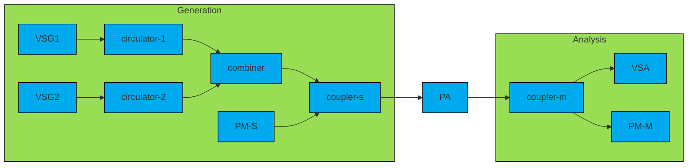

# RF Test System
- VSG --> Coupler --> PA --> Coupler --> VSA
[](https://mermaid-js.github.io/mermaid-live-editor/edit/##eyJjb2RlIjoiZ3JhcGggTFJcbiAgICBjbGFzc0RlZiBkZWZhdWx0IGZpbGw6IzBhZSxzdHJva2U6IzAwMCxzdHJva2Utd2lkdGg6MXB4XG4gICAgc3R5bGUgZ2VuIGZpbGw6IzlkNSxzdHJva2U6IzAwMCxzdHJva2Utd2lkdGg6MXB4O1xuICAgIHN0eWxlIGFuYSBmaWxsOiM5ZDUsc3Ryb2tlOiMwMDAsc3Ryb2tlLXdpZHRoOjFweDtcblxuICAgIHN1YmdyYXBoIGdlbltHZW5lcmF0aW9uXVxuICAgICAgICBWU0cxIC0tPiBjaXJjdWxhdG9yLTFcbiAgICAgICAgY2lyY3VsYXRvci0xIC0tPiBjb21iaW5lclxuICAgICAgICBWU0cyIC0tPiBjaXJjdWxhdG9yLTJcbiAgICAgICAgY2lyY3VsYXRvci0yIC0tPiBjb21iaW5lclxuICAgICAgICBjb21iaW5lciAtLT4gY291cGxlci1zXG4gICAgICAgIFBNLVMgLS0-IGNvdXBsZXItc1xuICAgIGVuZFxuXG4gICAgICAgIGNvdXBsZXItcyAtLT4gUEFcbiAgICAgICAgUEEgLS0-IGNvdXBsZXItbVxuXG4gICAgc3ViZ3JhcGggYW5hW0FuYWx5c2lzXVxuICAgICAgICBjb3VwbGVyLW0gLS0-IFZTQVxuICAgICAgICBjb3VwbGVyLW0gLS0-IFBNLU1cbiAgICBlbmQiLCJtZXJtYWlkIjoie1xuICBcInRoZW1lXCI6IFwiZGVmYXVsdFwiXG59IiwidXBkYXRlRWRpdG9yIjp0cnVlLCJhdXRvU3luYyI6dHJ1ZSwidXBkYXRlRGlhZ3JhbSI6dHJ1ZX0)

