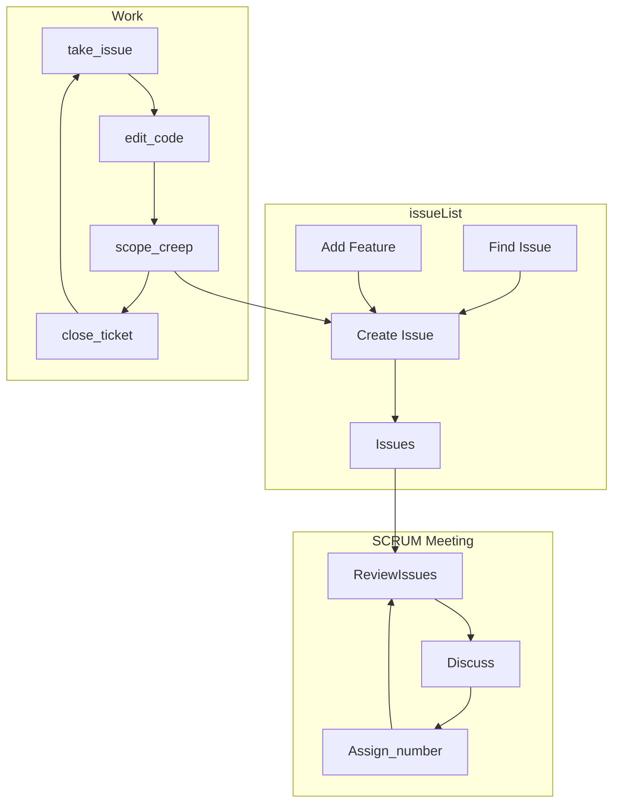

# Agile SW Development

[](https://mermaid-js.github.io/mermaid-live-editor/edit/##eyJjb2RlIjoiZ3JhcGggVERcbiAgICBzdWJncmFwaCBTRzFbSXNzdWUgTWFuYWdlbWVudF1cbiAgICAgICAgQVtGaW5kIElzc3VlXSAtLT4gQ1tDcmVhdGUgSXNzdWVdXG4gICAgICAgIEJbQWRkIEZlYXR1cmVdIC0tPiBDW0NyZWF0ZSBJc3N1ZV1cbiAgICAgICAgQy0tPiBEW0lzc3Vlc11cbiAgICBlbmRcblxuICAgIHN1YmdyYXBoIFNHMltTQ1JVTSBNZWV0aW5nXVxuICAgICAgICBSZXZpZXdJc3N1ZXMgLS0-IGFhYWFhYURpc2N1c3MgLS0-IFZvdGVfc3RvcnlfcHRzIC0tPkFzc2lnbl9zdG9yeV9wdHMgLS0-IFJldmlld0lzc3Vlc1xuICAgIGVuZFxuXG4gICAgc3ViZ3JhcGggU0czW1dvcmtdXG4gICAgICAgIHRha2VfaXNzdWUgLS0-IGVkaXRfY29kZSAtLT4gYXNkZntzY29wZV9jcmVlcH0gLS0gbm8gLS0-IGNsb3NlX2lzc3VlXG4gICAgZW5kXG5cbiAgICBhc2RmIC0tIHllcyAtLT4gQ1xuICAgIEQgLS0-IFJldmlld0lzc3VlcyIsIm1lcm1haWQiOiJ7XG4gIFwidGhlbWVcIjogXCJkZWZhdWx0XCJcbn0iLCJ1cGRhdGVFZGl0b3IiOmZhbHNlLCJhdXRvU3luYyI6dHJ1ZSwidXBkYXRlRGlhZ3JhbSI6ZmFsc2V9)

