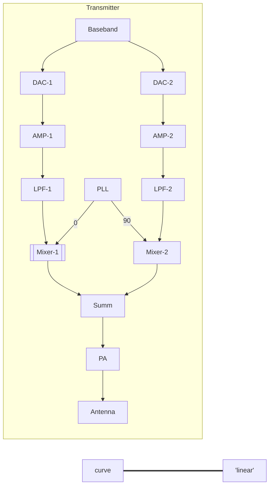

```mermaid
graph LR
    curve === 'linear'
    subgraph gen[Transmitter]
        Baseband --> DAC-1
        DAC-1 --> AMP-1 --> LPF-1 --> Mixer-1 --> Summ
        PLL -- 0 --> Mixer-1[[Mixer-1]]
        PLL -- 90 --> Mixer-2
        DAC-2 --> AMP-2 --> LPF-2 --> Mixer-2 --> Summ
        Baseband --> DAC-2 

        Summ --> PA --> Antenna
    end
```